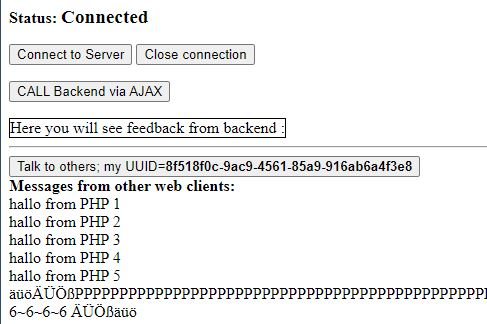

# Example

## simulateBackend.php

A PHP script that simulates a backend script called via AJAX from a web client   
to demonstrate `feedback` from backend.

## websocketCore.php

Base clase to be extended. Impements handshake encode, write decode, read.  
With this you can connect to any websocket server,. See directory ***websocketOrg*** 

## websocketPhp.php

Class that extends ***websocketCore***  , implemets dialog with this websocket server.  
Same functionality like ***socketPhpClient.php***

## testWithPHPSockets.php

Have the server started and waiting ....

in the command window  where you startet the server you should see some output
like this 

>***php runSocketServer.php -console***  
  
>Wed, 14 Jul 2021 08:38:41 +0200; Server initialized on WINNT  localhost:8091  
>Wed, 14 Jul 2021 08:38:41 +0200; Starting server...  
>Wed, 14 Jul 2021 08:38:41 +0200; Registered resource : /  
>Wed, 14 Jul 2021 08:38:41 +0200; Registered resource : /web  
>Wed, 14 Jul 2021 08:38:41 +0200; Registered resource : /php  
>

> ***php testWithPHPSockets.php***  

>Wed, 14 Jul 2021 08:41:12 +0200; Connecting from IP: ::1  
>Wed, 14 Jul 2021 08:41:12 +0200; New client connecting from [::1]:64265 on socket #20  
>  
>Wed, 14 Jul 2021 08:41:12 +0200; Handshake: /phpClient  
>Wed, 14 Jul 2021 08:41:12 +0200; ClientType:tcp  
>Wed, 14 Jul 2021 08:41:12 +0200; Telling Client to start on  #20  
>Wed, 14 Jul 2021 08:41:12 +0200; Buffering ON  
>Wed, 14 Jul 2021 08:41:12 +0200; Buffering OFF  
>Wed, 14 Jul 2021 08:41:12 +0200; Socket 20 - Client disconnected by Server - TCP connection lost  
>Wed, 14 Jul 2021 08:41:12 +0200; Connection closed to socket #20  
 
If you have a web client open and running in a browser you should  
see the messages also in the web client window. 

